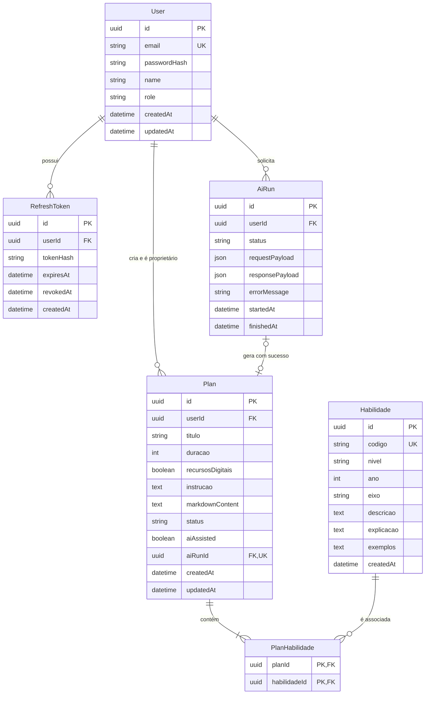
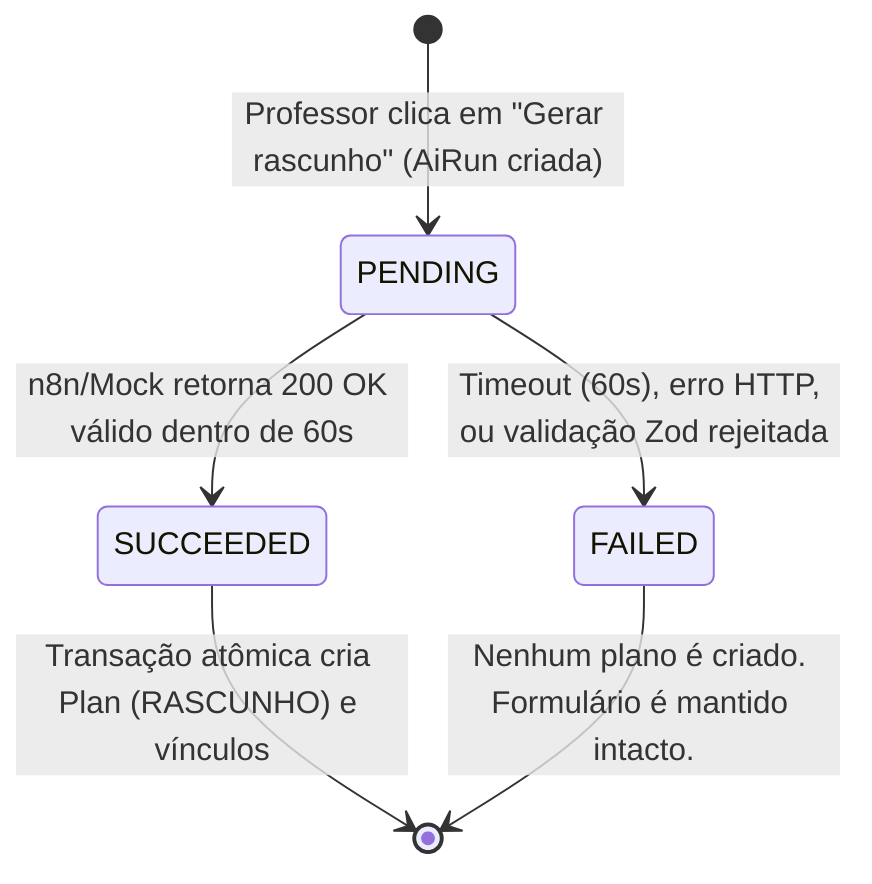

# Data Model: Planejador BNCC

**Branch**: `docs/planejamento` | **Date**: 2026-10-02 | **Spec**: [spec.md](./spec.md)

Este documento especifica a modelagem relacional de dados para o **Planejador BNCC**, incluindo entidades, relacionamentos, tipos, regras de integridade e schema representativo do Prisma.

---

## 1. Diagrama Entidade-Relacionamento (ERD)



---

## 2. Descrição das Entidades e Atributos

### 2.1 `User`
Representa os professores autorizados a acessar o sistema.
- `id` (UUID, PK): Identificador universal único gerado automaticamente.
- `email` (VARCHAR(255), UK, Not Null): E-mail do professor (usado no login e como identificador de sessão no n8n).
- `passwordHash` (VARCHAR(255), Not Null): Hash criptográfico seguro da senha (bcrypt/argon2).
- `name` (VARCHAR(150), Not Null): Nome completo de exibição do professor.
- `role` (VARCHAR(50), Not Null, Default: `'PROFESSOR'`): Perfil pedagógico do usuário.
- `createdAt` (TIMESTAMP, Not Null, Default: `NOW()`): Data de cadastro.
- `updatedAt` (TIMESTAMP, Not Null): Data da última atualização.

### 2.2 `RefreshToken`
Controla os tokens de atualização de sessão emitidos em cookies HttpOnly seguros.
- `id` (UUID, PK): Identificador do registro de token.
- `userId` (UUID, FK -> User.id, Not Null, OnDelete: Cascade): Professor proprietário da sessão.
- `tokenHash` (VARCHAR(255), Not Null): Hash criptográfico do token aleatório gerado.
- `expiresAt` (TIMESTAMP, Not Null): Data e hora de expiração (7 dias após emissão).
- `revokedAt` (TIMESTAMP, Nullable): Data de revogação explícita (no logout ou renovação).
- `createdAt` (TIMESTAMP, Not Null, Default: `NOW()`): Data de emissão.

### 2.3 `Habilidade`
Catálogo canônico de habilidades oficiais da BNCC.
- `id` (UUID, PK): Identificador único da habilidade.
- `codigo` (VARCHAR(20), UK, Not Null): Código canônico oficial (ex.: `EF01CO01`, `EF02CO04`).
- `nivel` (VARCHAR(100), Not Null): Nível de ensino (ex.: `Ensino Fundamental`).
- `ano` (INT, Nullable): Ano escolar numérico quando aplicável (ex.: `1`, `2`).
- `eixo` (VARCHAR(100), Not Null): Eixo ou componente temático (ex.: `Pensamento Computacional (PC)`, `Cultura Digital (CD)`).
- `descricao` (TEXT, Not Null): Texto oficial da habilidade com o objetivo de aprendizagem.
- `explicacao` (TEXT, Nullable): Detalhamento didático e pedagógico da habilidade.
- `exemplos` (TEXT, Nullable): Exemplos práticos de aplicação em sala de aula e links complementares.
- `createdAt` (TIMESTAMP, Not Null, Default: `NOW()`): Registro da inserção.

### 2.4 `Plan`
Rascunho de plano de aula gerado com auxílio de IA e gerenciado pelo professor.
- `id` (UUID, PK): Identificador único do plano.
- `userId` (UUID, FK -> User.id, Not Null, OnDelete: Cascade): Professor proprietário. **Chave de isolamento estrito**.
- `titulo` (VARCHAR(255), Not Null): Título do plano (gerado inicialmente a partir das habilidades e editável pelo professor).
- `duracao` (INT, Not Null): Duração da aula em minutos (validação: `duracao > 0`).
- `recursosDigitais` (BOOLEAN, Not Null, Default: `false`): Flag indicando se a aula usa recursos digitais.
- `instrucao` (TEXT, Not Null): Instrução pedagógica complementar fornecida pelo professor.
- `markdownContent` (TEXT, Not Null): Corpo textual do plano em formato Markdown editável.
- `status` (ENUM `PlanStatus`, Not Null, Default: `'RASCUNHO'`): Estado do ciclo de vida. Valor fixo `'RASCUNHO'` no escopo atual.
- `aiAssisted` (BOOLEAN, Not Null, Default: `true`): Sinalizador de auxílio por inteligência artificial (Princípio IV).
- `aiRunId` (UUID, FK -> AiRun.id, UK, Nullable, OnDelete: Set Null): Vínculo com a execução de IA que gerou o plano.
- `createdAt` (TIMESTAMP, Not Null, Default: `NOW()`): Data e hora de criação.
- `updatedAt` (TIMESTAMP, Not Null): Data e hora da última modificação manual.

### 2.5 `PlanHabilidade`
Tabela de ligação associativa muitos-para-muitos entre planos e habilidades da BNCC.
- `planId` (UUID, FK -> Plan.id, Not Null, OnDelete: Cascade): Identificador do plano.
- `habilidadeId` (UUID, FK -> Habilidade.id, Not Null, OnDelete: Restrict): Identificador da habilidade selecionada.
- **Chave Primária Composta**: `(planId, habilidadeId)`.

### 2.6 `AiRun`
Registro de auditoria e rastreabilidade para cada chamada ao serviço de geração por IA (n8n ou Mock).
- `id` (UUID, PK): Identificador único da execução.
- `userId` (UUID, FK -> User.id, Not Null, OnDelete: Cascade): Professor solicitante.
- `status` (ENUM `AiRunStatus`, Not Null, Default: `'PENDING'`): Estado do processamento (`PENDING`, `SUCCEEDED`, `FAILED`).
- `requestPayload` (JSONB, Not Null): Payload exato enviado para o webhook do n8n (sessao, habilidade, instrucao, duracao, recursos_digitais).
- `responsePayload` (JSONB, Nullable): Resposta completa retornada em caso de sucesso.
- `errorMessage` (TEXT, Nullable): Mensagem descritiva de erro em caso de falha ou timeout.
- `startedAt` (TIMESTAMP, Not Null, Default: `NOW()`): Início do processamento.
- `finishedAt` (TIMESTAMP, Nullable): Término do processamento.

---

## 3. Estados e Transições

### 3.1 Ciclo de Vida da Execução de IA (`AiRunStatus`)



### 3.2 Ciclo de Vida do Plano (`PlanStatus`)
- No escopo atual, o plano nasce e permanece como `RASCUNHO`.
- O professor pode editar o título e o corpo em Markdown indefinidamente, atualizando o campo `updatedAt`.
- Não há transição para `FINALIZADO` ou `PUBLICADO` neste incremento (Explicitamente fora de escopo conforme FR e Spec).

---

## 4. Regras de Integridade e Validação

1. **Isolamento e Privacidade por Professor (Princípio III)**:
   - Toda consulta ou mutação em `Plan` DEVE conter o predicado: `WHERE id = :planId AND userId = :currentUserId`.
   - Se nenhuma linha for afetada ou encontrada, a API retorna `404 Not Found`.
2. **Atomicidade da Geração (Princípio V)**:
   - A criação de `Plan` e de suas relações em `PlanHabilidade` ocorre na **mesma transação relacional** que atualiza o `AiRun` para `SUCCEEDED`.
   - Em caso de falha da chamada ao n8n, a transação do plano não é iniciada e o `AiRun` é atualizado para `FAILED`.
3. **Validação de Edição Manual**:
   - `titulo` não pode ser vazio ou conter apenas caracteres de espaço em branco (`TRIM(titulo) != ''`).
   - `markdownContent` não pode ser vazio ou conter apenas caracteres de espaço em branco (`TRIM(markdownContent) != ''`).
4. **Validação de Parâmetros de Geração**:
   - `duracao` deve ser um número inteiro estritamente positivo (`duracao > 0`).
   - Pelo menos 1 habilidade deve ser vinculada (`habilidadeIds.length >= 1`).
5. **Idempotência do Seed**:
   - Contas de demonstração são inseridas via `upsert` com base em `User.email`.
   - Habilidades da BNCC são inseridas via `upsert` com base em `Habilidade.codigo`.

---

## 5. Schema Prisma (`schema.prisma`)

```prisma
datasource db {
  provider = "postgresql"
  url      = env("DATABASE_URL")
}

generator client {
  provider = "prisma-client-js"
}

enum PlanStatus {
  RASCUNHO
}

enum AiRunStatus {
  PENDING
  SUCCEEDED
  FAILED
}

model User {
  id           String         @id @default(uuid()) @db.Uuid
  email        String         @unique @db.VarChar(255)
  passwordHash String         @db.VarChar(255)
  name         String         @db.VarChar(150)
  role         String         @default("PROFESSOR") @db.VarChar(50)
  createdAt    DateTime       @default(now()) @db.Timestamp(6)
  updatedAt    DateTime       @updatedAt @db.Timestamp(6)

  refreshTokens RefreshToken[]
  plans         Plan[]
  aiRuns        AiRun[]

  @@map("users")
}

model RefreshToken {
  id        String    @id @default(uuid()) @db.Uuid
  userId    String    @db.Uuid
  tokenHash String    @db.VarChar(255)
  expiresAt DateTime  @db.Timestamp(6)
  revokedAt DateTime? @db.Timestamp(6)
  createdAt DateTime  @default(now()) @db.Timestamp(6)

  user User @relation(fields: [userId], references: [id], onDelete: Cascade)

  @@index([userId])
  @@map("refresh_tokens")
}

model Habilidade {
  id         String   @id @default(uuid()) @db.Uuid
  codigo     String   @unique @db.VarChar(20)
  nivel      String   @db.VarChar(100)
  ano        Int?     @db.Integer
  eixo       String   @db.VarChar(100)
  descricao  String   @db.Text
  explicacao String?  @db.Text
  exemplos   String?  @db.Text
  createdAt  DateTime @default(now()) @db.Timestamp(6)

  planHabilidades PlanHabilidade[]

  @@index([nivel, ano, eixo])
  @@map("habilidades")
}

model Plan {
  id               String     @id @default(uuid()) @db.Uuid
  userId           String     @db.Uuid
  titulo           String     @db.VarChar(255)
  duracao          Int        @db.Integer
  recursosDigitais Boolean    @default(false)
  instrucao        String     @db.Text
  markdownContent  String     @db.Text
  status           PlanStatus @default(RASCUNHO)
  aiAssisted       Boolean    @default(true)
  aiRunId          String?    @unique @db.Uuid
  createdAt        DateTime   @default(now()) @db.Timestamp(6)
  updatedAt        DateTime   @updatedAt @db.Timestamp(6)

  user            User             @relation(fields: [userId], references: [id], onDelete: Cascade)
  aiRun           AiRun?           @relation(fields: [aiRunId], references: [id], onDelete: SetNull)
  planHabilidades PlanHabilidade[]

  @@index([userId, updatedAt(sort: Desc)])
  @@map("plans")
}

model PlanHabilidade {
  planId       String @db.Uuid
  habilidadeId String @db.Uuid

  plan       Plan       @relation(fields: [planId], references: [id], onDelete: Cascade)
  habilidade Habilidade @relation(fields: [habilidadeId], references: [id], onDelete: Restrict)

  @@id([planId, habilidadeId])
  @@map("plan_habilidades")
}

model AiRun {
  id              String      @id @default(uuid()) @db.Uuid
  userId          String      @db.Uuid
  status          AiRunStatus @default(PENDING)
  requestPayload  Json        @db.JsonB
  responsePayload Json?       @db.JsonB
  errorMessage    String?     @db.Text
  startedAt       DateTime    @default(now()) @db.Timestamp(6)
  finishedAt      DateTime?   @db.Timestamp(6)

  user User  @relation(fields: [userId], references: [id], onDelete: Cascade)
  plan Plan?

  @@index([userId, status])
  @@map("ai_runs")
}
```
