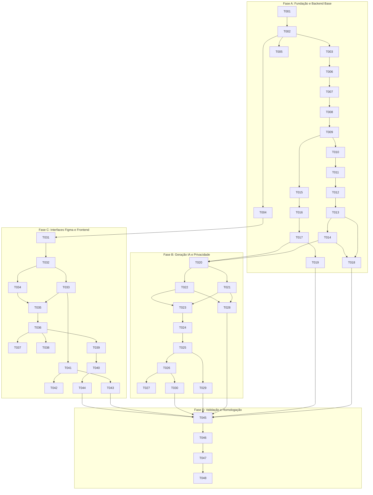

# Implementation Tasks: Planejador BNCC

**Branch**: `docs/planejamento` | **Date**: 2026-10-02 | **Spec**: [spec.md](./spec.md) | **Plan**: [plan.md](./plan.md)

Este documento organiza as tarefas de implementação por dependência em quatro fases identificáveis (**A**, **B**, **C**, **D**), com critérios de conclusão verificáveis e testes críticos integrados em cada etapa. Não se supõe a existência prévia de arquivos de código ou de features anteriores.

---

## Estrutura de Fases

- **Fase A**: Monorepo, scripts, ambiente, banco de dados, Prisma, autenticação e catálogo BNCC.
- **Fase B**: Geração assistida por IA, cliente n8n, validação de schema, ciclo de vida de `AiRun` e privacidade/autorização de planos.
- **Fase C**: Telas Figma (9 frames), estados visuais, navegação, listagem de rascunhos, editor Markdown e sanitização.
- **Fase D**: Testes automatizados ponta a ponta, validação dos cenários do `quickstart.md`, documentação e verificação de qualidade final.

---

## Fase A: Monorepo, Scripts, Ambiente, Banco, Prisma, Autenticação e Catálogo

**Objetivo**: Estabelecer a infraestrutura do monorepo pnpm, banco PostgreSQL no Docker, ORM Prisma com migrações e seed idempotente, autenticação JWT com cookies HttpOnly e serviço de catálogo da BNCC com busca e filtros.

### Infraestrutura, Scripts e Ambiente
- [ ] T001 [PhaseA] Configurar `pnpm-workspace.yaml` e criar `package.json` na raiz com workspaces `apps/*` e scripts unificados `dev`, `lint`, `typecheck`, `test`, `test:integration` e `build` em `package.json`.
- [ ] T002 [PhaseA] Criar `docker-compose.yml` na raiz contendo serviço PostgreSQL 16 Alpine com porta 5432 exposta, volume persistente e healthcheck em `docker-compose.yml`.
- [ ] T003 [P] [PhaseA] Inicializar workspace backend `apps/api` com NestJS, TypeScript estrito, dependências essenciais (`@nestjs/common`, `@nestjs/jwt`, `@nestjs/passport`, `passport-jwt`, `cookie-parser`, `bcrypt`, `zod`, `@prisma/client`) e scripts locais em `apps/api/package.json` e `apps/api/tsconfig.json`.
- [ ] T004 [P] [PhaseA] Inicializar workspace frontend `apps/web` com Next.js 15 App Router, TypeScript estrito, dependências essenciais (`react-markdown`, `rehype-sanitize`) e scripts locais em `apps/web/package.json` e `apps/web/tsconfig.json`.
- [ ] T005 [P] [PhaseA] Criar arquivos de configuração de ambiente de exemplo `apps/api/.env.example` e `apps/web/.env.example` documentando portas (3001 e 3000), `DATABASE_URL`, segredos JWT, `COOKIE_SECURE=false` para localhost e flags do n8n.

### Banco de Dados, Modelagem e Seed
- [ ] T006 [PhaseA] Configurar Prisma Schema com os modelos `User`, `RefreshToken`, `Habilidade`, `Plan`, `PlanHabilidade` e `AiRun` com todas as restrições relacionais e índices descritos em `specs/001-planejador-bncc/data-model.md` em `apps/api/prisma/schema.prisma`.
- [ ] T007 [PhaseA] Gerar migração inicial do Prisma e script de criação das tabelas relacionais em `apps/api/prisma/migrations/`.
- [ ] T008 [PhaseA] Implementar script de seed idempotente que realiza `upsert` das contas de demonstração (`ana@demo.bncc.br` / Profª Ana Souza e `marcos@demo.bncc.br` / Prof. Marcos Lima) com senha `demo123` criptografada, e `upsert` das 5 habilidades canônicas a partir de `docs/data/bncc-recorte.json` em `apps/api/prisma/seed.ts`.
- [ ] T009 [PhaseA] Implementar `PrismaService` e `PrismaModule` para injeção de dependência e gerenciamento do ciclo de vida da conexão do banco em `apps/api/src/prisma/prisma.service.ts` e `apps/api/src/prisma/prisma.module.ts`.

### Módulo de Autenticação (`apps/api/src/auth`)
- [ ] T010 [PhaseA] Criar DTOs de autenticação com validação `LoginDto` (`email` válido e `password` obrigatório) em `apps/api/src/auth/dto/login.dto.ts`.
- [ ] T011 [PhaseA] Implementar `AuthService` com lógica de verificação de senha por hash, emissão de Access Token curto (15 min), geração de Refresh Token criptograficamente seguro (7 dias), gravação exclusiva do hash do refresh token em `RefreshToken` e revogação no logout em `apps/api/src/auth/auth.service.ts`.
- [ ] T012 [PhaseA] Configurar `JwtStrategy` e `JwtAuthGuard` para proteção de rotas privadas e injeção do usuário logado na requisição em `apps/api/src/auth/jwt.strategy.ts` e `apps/api/src/auth/jwt-auth.guard.ts`.
- [ ] T013 [PhaseA] Implementar `AuthController` disponibilizando `POST /auth/login` (define cookie `HttpOnly` com `SameSite=Lax`), `POST /auth/refresh` (com rotação de token e verificação do header `x-requested-with`), `POST /auth/logout` (revoga hash e expira cookie) e `GET /auth/me` em `apps/api/src/auth/auth.controller.ts`.
- [ ] T014 [PhaseA] Configurar bootstrap da API com CORS restrito à origem web (`http://localhost:3000`), `cookieParser()`, `ValidationPipe` global e prefixo de rotas em `apps/api/src/main.ts`.

### Módulo do Catálogo BNCC (`apps/api/src/bncc`)
- [ ] T015 [PhaseA] Criar DTO de filtros para consulta de habilidades `GetHabilidadesQueryDto` (`search`, `nivel`, `ano`, `eixo`) em `apps/api/src/bncc/dto/get-habilidades-query.dto.ts`.
- [ ] T016 [PhaseA] Implementar `BnccService` com métodos para busca textual combinada (`codigo` e `descricao`) e filtros por nível, ano escolar e eixo temático em `apps/api/src/bncc/bncc.service.ts`.
- [ ] T017 [PhaseA] Implementar `BnccController` disponibilizando `GET /bncc/habilidades` e `GET /bncc/habilidades/:id` protegido por `JwtAuthGuard` em `apps/api/src/bncc/bncc.controller.ts`.

### Testes Críticos da Fase A
- [ ] T018 [P] [PhaseA] Criar testes automatizados de integração para o fluxo de autenticação (login válido, login com credenciais inválidas 401, renovação de token, logout e consulta `/auth/me`) em `apps/api/test/auth.e2e-spec.ts`.
- [ ] T019 [P] [PhaseA] Criar testes automatizados de integração para o catálogo BNCC (listagem total, filtros por ano/nível, busca por termo do código e 404 em ID inexistente) em `apps/api/test/bncc.e2e-spec.ts`.

**Critério de Conclusão da Fase A**:
- Containers sobem via `docker compose up -d postgres`.
- Seed popula com sucesso as 2 contas e 5 habilidades de forma idempotente.
- Endpoints `/auth/*` e `/bncc/*` respondem conforme contratos e passam nos testes `auth.e2e-spec.ts` e `bncc.e2e-spec.ts`.

---

## Fase B: Geração, Cliente n8n, Validação, AiRun e Privacidade de Planos

**Objetivo**: Implementar o cliente HTTP n8n em estrita conformidade com `docs/contracts/n8n.md`, timeout configurável de 60s, zero retentativas automáticas, validação de resposta com Zod, adaptador mock local determinístico, orquestração transacional de `AiRun` e controle rigoroso de ownership com resposta 404 para planos alheios.

### Cliente n8n e Adaptador Mock (`apps/api/src/ai`)
- [ ] T020 [PhaseB] Criar schemas Zod e DTOs de integração com n8n (`N8nGenerateRequestDto` e `N8nResponseSchema` validando `success: true`, `sessao`, `habilidade`, `answer` Markdown com min 10 caracteres e `format: "markdown"`) em `apps/api/src/ai/dto/n8n-integration.dto.ts`.
- [ ] T021 [PhaseB] Implementar cliente HTTP n8n com envio de header `x-api-key`, header de rastreabilidade `x-request-id`, cancelamento estrito por `AbortController` baseado em `N8N_TIMEOUT_MS` (60000ms), e política expressa de zero retries automáticos (`retries: 0`) em `apps/api/src/ai/n8n-client.service.ts`.
- [ ] T022 [PhaseB] Implementar adaptador Mock local determinístico para geração de planos de aula estruturados em Markdown sem dependência de serviços externos, com suporte à latência configurável e simulação determinística de erros de teste em `apps/api/src/ai/n8n-mock.adapter.ts`.
- [ ] T023 [PhaseB] Implementar `AiService` orquestrador que seleciona entre Mock ou Cliente Real (baseado em `N8N_MOCK_ENABLED`), formata múltiplas habilidades no formato `"CODIGO — Descrição"`, e orquestra o ciclo de vida de `AiRun` em `apps/api/src/ai/ai.service.ts`.

### Módulo de Planos e Atomicidade Transacional (`apps/api/src/plans`)
- [ ] T024 [PhaseB] Criar DTOs de planos: `GeneratePlanDto` (validando `habilidadeIds` com min 1 item, `duracao` inteiro positivo, `recursosDigitais` boolean e `instrucao` string) e `UpdatePlanDto` (validando `titulo` e `markdownContent` com texto não vazio) em `apps/api/src/plans/dto/generate-plan.dto.ts` e `apps/api/src/plans/dto/update-plan.dto.ts`.
- [ ] T025 [PhaseB] Implementar método de geração em `PlansService`: cria `AiRun` como `PENDING`; em sucesso, executa transação relacional atômica (`prisma.$transaction`) que atualiza `AiRun` para `SUCCEEDED`, grava `Plan` com `status: RASCUNHO`, `aiAssisted: true` e vínculos em `PlanHabilidade`; em falha/timeout, atualiza `AiRun` para `FAILED` e NÃO cria nenhum registro de plano em `apps/api/src/plans/plans.service.ts`.
- [ ] T026 [PhaseB] Implementar métodos de consulta e edição em `PlansService` (`findAllByUser`, `findOneByUser`, `updateByUser`) aplicando obrigatoriamente o filtro `where: { id, userId: currentUser.id }` e lançando `NotFoundException` (HTTP 404) quando o registro não existir ou pertencer a outro professor em `apps/api/src/plans/plans.service.ts`.
- [ ] T027 [PhaseB] Implementar `PlansController` com endpoints `POST /plans/generate`, `GET /plans`, `GET /plans/:id` e `PUT /plans/:id`, todos protegidos por `JwtAuthGuard` em `apps/api/src/plans/plans.controller.ts`.

### Testes Críticos da Fase B
- [ ] T028 [P] [PhaseB] Criar testes unitários para o cliente n8n e mock cobrindo validação de schema Zod, cancelamento por timeout aos 60s e ausência de retentativas em `apps/api/test/n8n-client.spec.ts`.
- [ ] T029 [P] [PhaseB] Criar testes de integração verificando a atomicidade relacional: em caso de sucesso da IA o plano é salvo em `RASCUNHO` com `AiRun` em `SUCCEEDED`; em caso de erro da IA, zero planos são gravados e `AiRun` fica como `FAILED` em `apps/api/test/plans-generation.e2e-spec.ts`.
- [ ] T030 [P] [PhaseB] Criar testes de integração verificando a garantia estrita de privacidade docente: Professor 1 cria plano e Professor 2 recebe HTTP 404 ao tentar `GET /plans/:id` ou `PUT /plans/:id` em `apps/api/test/plans-ownership.e2e-spec.ts`.

**Critério de Conclusão da Fase B**:
- Geração assistida cria plano em `RASCUNHO` com mock ou n8n real.
- Falhas na IA não criam planos parciais no banco.
- Tentativa de acesso a plano alheio retorna 404.
- Todos os testes de integração de `n8n-client.spec.ts`, `plans-generation.e2e-spec.ts` e `plans-ownership.e2e-spec.ts` passam com 100% de sucesso.

---

## Fase C: Telas Figma, Estados, Lista e Editor

**Objetivo**: Construir o frontend em Next.js com Design System nativo em CSS (estritamente sem Tailwind), cobrindo todos os 9 frames aprovados do Figma (`docs/design/`), gerenciamento de tokens em memória, proteção contra XSS na pré-visualização de Markdown e controle de navegação com dados não salvos.

### Design System e Componentes Base
- [ ] T031 [PhaseC] Criar arquivo de tokens CSS globais `apps/web/src/styles/tokens.css` com todas as variáveis extraídas do Frame 01 (Cores `#245F9E`, `#173A63`, `#2F73B8`, `#247A55`, `#A45B12`, `#B43A3A`, escala modular de espaçamento base 4px, raios de borda 8px/12px e tipografia Inter).
- [ ] T032 [PhaseC] Criar folha de estilos global `apps/web/src/styles/globals.css` com reset moderno, estilos de acessibilidade (foco visível WCAG AA) e classes utilitárias semânticas.
- [ ] T033 [P] [PhaseC] Implementar componentes reutilizáveis de interface (`Button`, `InputField`, `TextareaField`, `CheckboxField`, `SelectField`, `Badge`, `Card`, `ToastNotification`, `ModalDialog` com focus trap) em `apps/web/src/components/ui/`.
- [ ] T034 [P] [PhaseC] Implementar cabeçalho da aplicação `AppHeader` com identificação do professor logado e botão de ação "Sair" em `apps/web/src/components/layout/AppHeader.tsx`.

### Estado de Sessão e Cliente de API
- [ ] T035 [PhaseC] Implementar `AuthContext` com retenção do Access Token de curta duração estritamente em memória, recuperação de sessão transparente via `POST /auth/refresh` na montagem e métodos de login/logout em `apps/web/src/contexts/AuthContext.tsx`.
- [ ] T036 [PhaseC] Implementar cliente HTTP do frontend (`apiClient`) configurado com injeção automática do Bearer token, interceptor para renovação via cookie HttpOnly e envio de `credentials: 'include'` em `apps/web/src/services/api-client.ts`.

### Telas do Figma
- [ ] T037 [PhaseC] Implementar Tela de Login baseada no Frame 02 (`02_login_credenciais_invalidas.png`): card centralizado, botões de acesso de 1 clique ("Profª Ana Souza" e "Prof. Marcos Lima"), formulário com campos de e-mail e senha, e banner de erro semântico em `apps/web/src/app/page.tsx` e `apps/web/src/app/login.module.css`.
- [ ] T038 [PhaseC] Implementar Tela "Meus Planos" baseada nos Frames 03 e 04 (`03_meus_planos_rascunhos.png` e `04_meus_planos_estado_vazio.png`): listagem de rascunhos em grid/cards com badge `RASCUNHO`, data de atualização e habilidades, e estado vazio acolhedor com CTA "Criar meu primeiro plano" em `apps/web/src/app/planos/page.tsx` e `apps/web/src/app/planos/planos.module.css`.
- [ ] T039 [PhaseC] Implementar seletor de habilidades BNCC com filtros de nível, ano e eixo, campo de busca com debounce e lista de chips ativos com botão de remoção individual (`x`) em `apps/web/src/components/bncc/HabilidadeSelector.tsx`.
- [ ] T040 [PhaseC] Implementar Tela "Novo Plano" com os 3 estados visuais dos Frames 05, 06 e 07:
  - Frame 05: formulário completo com validações inline (`habilidadeIds` e `duracao > 0`).
  - Frame 06: estado de preparação visual com spinner, mensagem de até 60s e bloqueio de cliques duplos.
  - Frame 07: banner de erro de geração ("Não foi possível gerar - Nenhum plano foi salvo"), preservação total dos dados preenchidos no formulário e reabilitação do botão para nova tentativa voluntária em `apps/web/src/app/planos/novo/page.tsx` e `apps/web/src/app/planos/novo/novo.module.css`.
- [ ] T041 [PhaseC] Implementar componente de renderização de Markdown segura com `react-markdown` e `rehype-sanitize` bloqueando scripts, tags arbitrárias e URLs perigosas em `apps/web/src/components/editor/MarkdownPreview.tsx`.
- [ ] T042 [PhaseC] Implementar Tela de Detalhes e Edição do Rascunho baseada nos Frames 08 e 09:
  - Frame 08: título editável, badge `RASCUNHO`, selo `Auxílio por IA`, alternador entre abas "Editor Markdown" e "Pré-visualização", salvamento manual com notificação toast.
  - Frame 09: modal de confirmação de saída com dados não salvos ("Sair sem salvar?"), com opções "Continuar editando" e "Sair sem salvar" em `apps/web/src/app/planos/[id]/page.tsx` e `apps/web/src/app/planos/[id]/editor.module.css`.

### Testes Críticos da Fase C
- [ ] T043 [P] [PhaseC] Criar testes unitários para `MarkdownPreview` verificando que tags perigosas (`<script>`, `<iframe>`, `javascript:`) são sanitizadas e não são renderizadas no DOM em `apps/web/src/components/editor/MarkdownPreview.test.tsx`.
- [ ] T044 [P] [PhaseC] Criar testes de componente para o formulário de novo plano validando bloqueio com duração inválida, exibição do estado de preparação e preservação dos dados preenchidos após erro de geração em `apps/web/src/app/planos/novo/NovoPlanoForm.test.tsx`.

**Critério de Conclusão da Fase C**:
- Todos os 9 frames do Figma implementados e visualmente aderentes aos layouts de desktop e mobile.
- Zero uso de classes Tailwind.
- Alternância entre abas de edição e preview instantânea (< 200ms) com sanitização ativa.
- Modal de confirmação impede perda inadvertida de rascunhos não salvos.

---

## Fase D: Testes, Documentação e Verificação Final

**Objetivo**: Validar a solução completa por meio de testes automatizados ponta a ponta executando os cenários do `quickstart.md`, verificar os scripts raiz do monorepo, checar conformidade estrita com a Constituição e consolidar a documentação final.

### Validação Ponta a Ponta e Cenários de Quickstart
- [ ] T045 [PhaseD] Criar suíte de testes ponta a ponta automatizada que executa os 6 cenários de validação definidos em `specs/001-planejador-bncc/quickstart.md` (login 1 clique, busca/seleção BNCC, geração assistida mock, edição/salvamento com preview, isolamento 404 entre contas e retenção de formulário em falha) em `apps/api/test/quickstart-scenarios.e2e-spec.ts`.
- [ ] T046 [PhaseD] Executar e validar todos os scripts unificados do repositório raiz: `pnpm typecheck`, `pnpm lint`, `pnpm test`, `pnpm test:integration` e `pnpm build`, corrigindo quaisquer alertas de tipagem ou lint.

### Documentação e Revisão Final
- [ ] T047 [P] [PhaseD] Documentar instruções de inicialização e variáveis de ambiente em `README.md` na raiz do monorepo, referenciando o `quickstart.md` e detalhando a configuração do PostgreSQL e da porta 3001 (API) e 3000 (Web).
- [ ] T048 [PhaseD] Realizar auditoria de conformidade pós-implementação com os 8 princípios de `.specify/memory/constitution.md` (isolamento de segredos, autorização por professor, sanitização de Markdown, transacionalidade estrita e persistência reproduzível).

**Critério de Conclusão da Fase D**:
- Todos os 6 scripts raiz executam com código de saída 0.
- Suíte completa de testes unitários e de integração passando.
- Documentação sincronizada e pronta para homologação.

---

## Dependências e Ordem de Execução

### Oportunidades de Execução Paralela
1. **Fase A**: `T003` (API setup), `T004` (Web setup) e `T005` (Env configs) podem ser executados em paralelo assim que `T001` e `T002` terminarem.
2. **Fase A**: `T018` (testes de Auth) e `T019` (testes de BNCC) podem ser executados concorrentemente.
3. **Fase B**: `T021` (cliente n8n) e `T022` (mock adapter) podem ser implementados em paralelo após `T020`.
4. **Fase B**: `T028` (testes unitários n8n), `T029` (testes transacionais) e `T030` (testes de 404/privacidade) podem ser executados em paralelo.
5. **Fase C**: `T033` (componentes UI) e `T034` (AppHeader) podem ser desenvolvidos em paralelo após `T032`.
6. **Fase C**: `T043` (teste de sanitização) e `T044` (teste de formulário) podem ser escritos concorrentemente.

---

## Estratégia de MVP e Entrega Incremental

1. **Incremento 1 (Ao final da Fase A)**: Base pronta com PostgreSQL, Prisma, contas demo populadas e catálogo BNCC consultável com filtros.
2. **Incremento 2 (Ao final da Fase B)**: Motor de geração de IA funcional com mock local e n8n real, garantindo atomicidade transacional e isolamento estrito de planos com 404.
3. **Incremento 3 (Ao final da Fase C)**: Experiência completa do professor no navegador com os 9 frames do Figma, editor Markdown com sanitização ativa e sem perda de dados.
4. **Incremento 4 (Ao final da Fase D)**: Validação integral, testes automatizados passando em CI/CD e garantia de conformidade com a Constituição do Planejador BNCC.
